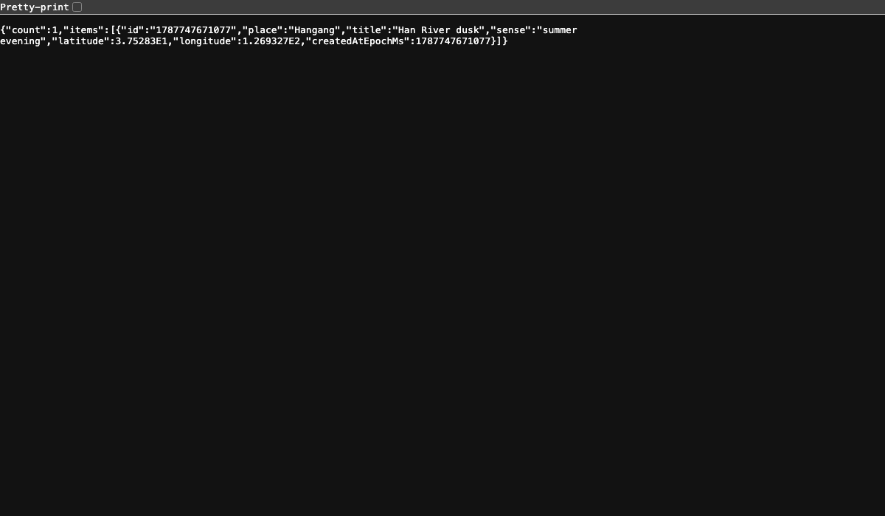

# Memory Atlas Server

Memory Atlas의 장소 탐색과 개인 기억 저장을 담당하는 C++20 백엔드입니다. 기존 실시간/장소 검색 기반을 유지하면서, 제품의 중심을 **장소에 남은 개인의 순간을 축적하는 Memory Atlas**로 전환했습니다.

## Runtime preview

| Persisted Memory API | Health endpoint |
| --- | --- |
|  |  |

위 캡처는 Release binary를 실제 실행한 뒤 샘플 기억을 `POST /memories`로 저장하고 브라우저에서 재조회한 결과입니다. 같은 실행에서 `/health`와 JSON 파일 persistence도 함께 검증했습니다.

## Product scope

- `GET /memories` — 저장된 기억 목록
- `POST /memories` — 장소, 제목, 감각 메모를 포함한 기억 생성
- `DELETE /memories/{id}` — 기억 삭제
- `POST /places/nearby` — 현재 위치 주변 장소 검색
- `POST /places/search` — 텍스트 기반 장소 검색
- `GET /places/details/{placeId}` — 장소 상세 정보
- `GET /place/photo/{photoRef}` — 장소 사진
- `GET /health`, `GET /status` — 운영 상태 확인
- WebSocket 서비스 — 기존 실시간 기반을 유지한 확장 지점

기억 데이터는 기본적으로 `data/memories.json`에 원자적으로 저장되며 프로세스가 재시작되어도 유지됩니다. 운영 환경에서는 `MEMORY_ATLAS_DATA_FILE`로 저장 경로를 지정할 수 있습니다.

## Architecture

```text
Flutter client
   │
   ├── Memory API ───────► Boost.Beast HTTP server
   │                         ├── JSON persistence
   │                         └── CORS / validation
   │
   └── Place discovery ──► PlacesApiHandler ──► Google Places API

Realtime extension ──────► Boost.Asio / WebSocket
```

핵심 스택은 C++20, Boost.Asio/Beast/JSON, OpenSSL, spdlog, CMake입니다.

## Local build

Homebrew 의존성을 사용할 경우:

```bash
brew install cmake boost spdlog openssl@3

cmake -S . -B build \
  -DCMAKE_BUILD_TYPE=Release \
  -DCMAKE_PREFIX_PATH="$(brew --prefix);$(brew --prefix openssl@3)" \
  -DOPENSSL_ROOT_DIR="$(brew --prefix openssl@3)"
cmake --build build --target MemoryAtlas-Server-App -j
```

저장 경로와 포트를 지정해 실행할 수 있습니다.

```bash
export HTTP_PORT=8080
export WS_PORT=33334
export MEMORY_ATLAS_DATA_FILE="$PWD/data/memories.json"
export GOOGLE_MAPS_API_KEY="..." # 장소 검색을 사용할 때만 필요
./build/MemoryAtlas-Server-App
```

## API example

```bash
curl -X POST http://127.0.0.1:8080/memories \
  -H 'Content-Type: application/json' \
  -d '{"place":"Kyoto","title":"비가 그친 골목","sense":"젖은 돌 냄새와 멀리 들리던 음악"}'

curl http://127.0.0.1:8080/memories
```

## Docker

```bash
docker build -t memory-atlas-server .
docker run --rm \
  -p 8080:8080 \
  -p 33334:33334 \
  -e MEMORY_ATLAS_DATA_FILE=/home/appuser/app/data/memories.json \
  -v "$PWD/data:/home/appuser/app/data" \
  memory-atlas-server
```

## Portfolio deployment

Mac mini self-hosting에서는 Cloudflare Tunnel → nginx → Memory Atlas Server 구조를 사용합니다. 공개 주소와 실제 서비스 포트는 저장소에 비밀값을 두지 않고 서버 측 설정으로 관리합니다.

## Repository boundary

이 저장소는 `memory-atlas-client`와 API 계약을 공유하지만 독립적으로 빌드/실행할 수 있습니다. 과거 팀 프로젝트의 배포 계정이나 서비스 주소를 요구하지 않으며, 현재 제품의 데이터 모델과 운영 경계는 Memory Atlas 기준으로 관리합니다.

## License

BSD 3-Clause License. 기존 오픈소스 고지와 개별 의존성 라이선스는 각 원문을 따릅니다.
